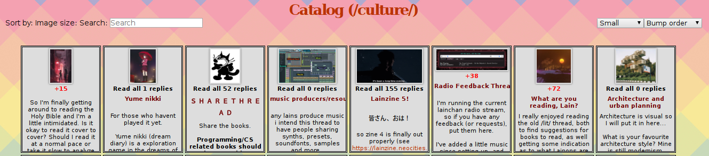

## Small userscript to browse lainchan more efficiently

It has two main features. First, browsing any \*/catalog.html page and clicking on a post will take you to the mod.php page for that post.

Second, it keeps track of how many replies a post has, and shows the number of new replies in red when there are new ones. It marks a post as fully read when you click on it in the catalog.

